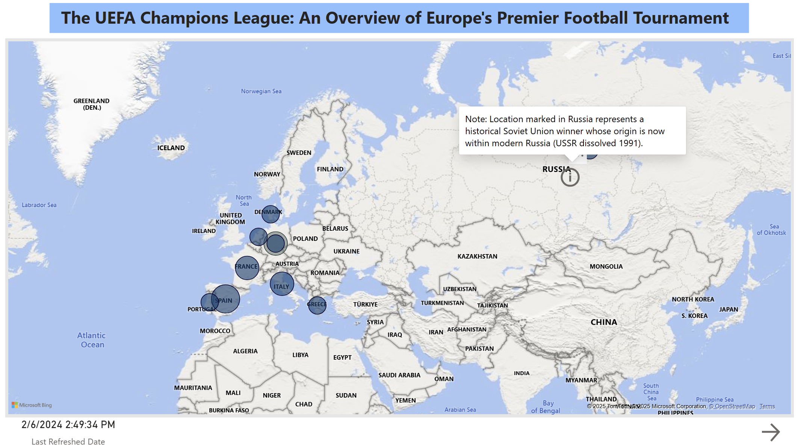

# UEFA European Championship Historical Analysis

## Project Overview

This project explores the history of the UEFA European Championship (Euro Cup) winners. It leverages Power BI's web connection capabilities to directly import and analyze historical data from Wikipedia. The goal is to visualize which countries have won the tournament over the years and identify key trends and top-performing nations.

## Data Source

* **Primary Source:** Simple Wikipedia - UEFA European Championship page ([https://simple.wikipedia.org/wiki/UEFA_Euro](https://simple.wikipedia.org/wiki/UEFA_Euro))
* **Data Collection Method:** Data was imported directly into Power BI using the "Get Data from Web" connector, targeting the relevant tables on the Wikipedia page.

## Tech Stack & Workflow

* **Tools:** Microsoft Power BI (including Power Query for web connection, data modeling, DAX, and visualization).
* **Workflow Summary:** Data Identified (Wikipedia) -> Data Imported (Power BI Web Connector) -> Data Modeled (Power BI) -> DAX Measures Created -> Visualizations Developed -> "Last Refreshed Date" Feature Added -> Analyzed & Visualized (Power BI).

## Validation, Analysis & Code

* **Validation:** Basic validation occurred implicitly through the visualization process in Power BI. Checks focused on ensuring countries and years were correctly associated. The "Last Refreshed Date" feature provides transparency on data freshness.
* **Analysis:**
    * Historical tracking of winning countries for each tournament year.
    * Aggregation of wins per country to identify the most successful nations.
    * Visualization of winners geographically using map visuals.
    * Development of different visual approaches over time to better represent the data.
    * Inclusion of a "Last Refreshed Date" display on report pages for data timeliness context.
    * Added an interactive element (information button) on the map visualization specifically for the Soviet Union to provide context, as the country no longer exists.

* **Code:** DAX was used within Power BI for calculations needed for visualizations, such as counting wins per country. Power Query M language was used implicitly by the Web connector and potentially for the refresh date logic.

## Key Findings

* The report identifies all countries that have won the UEFA European Championship since its inception.
* Spain is highlighted as a top winner with 3 titles. A total of 11 distinct countries (treating West Germany/Germany as one entity) have won the championship.
* An information button was added for the Soviet Union win, providing context since the country no longer exists.
* The report indicates the last time the data was refreshed.

**Note on structure: Pages 3-4 contain improved visualizations compared to pages 1-2, reflecting a learning process in Power BI.**

## Future Work / Limitations

* The analysis could be expanded to include runners-up, host nations, goal statistics, or player data if more detailed data sources were integrated.
* More advanced data validation steps could be implemented in Power Query upon import.
